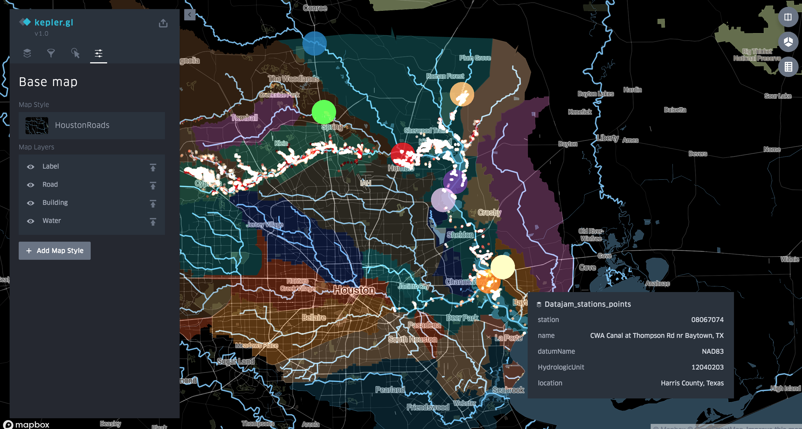

# Instructions for using the Kepler_Water_datajam.json to open the map in <a href="https://uber.github.io/kepler.gl/">Keplergl</a>. 

0. Download the json file Kepler_Water_datajam.json to your local computer. It should be in the same folder as this markdown file you're reading. It will have all the data and config to make the map. It will be large, so might be a little slow to download.
1. Go to https://uber.github.io/kepler.gl/#/demo
2. Click the add your own files button. Select the Kepler_Water_datajam.json in the same folder as this mardown file.
3. Get the same map as shown in the photos below. Play around with settings window to change appearance. 

The big circles are the data point where water quality data was collected, at least in terms of the data in this repo.

